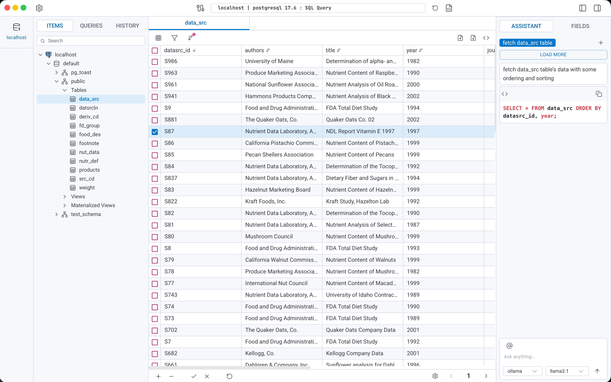
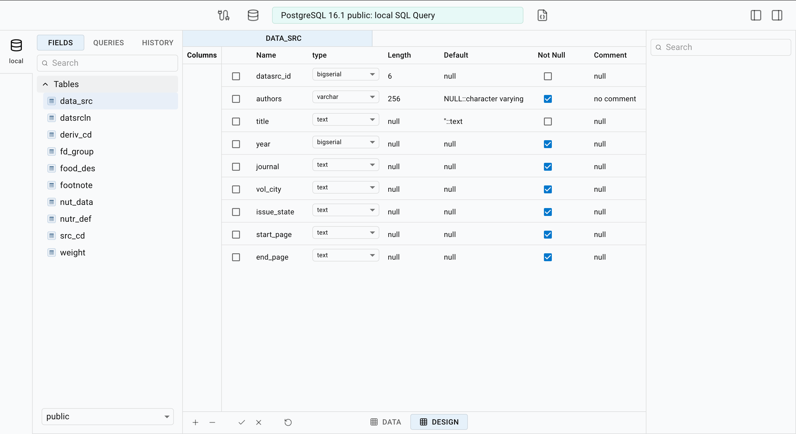
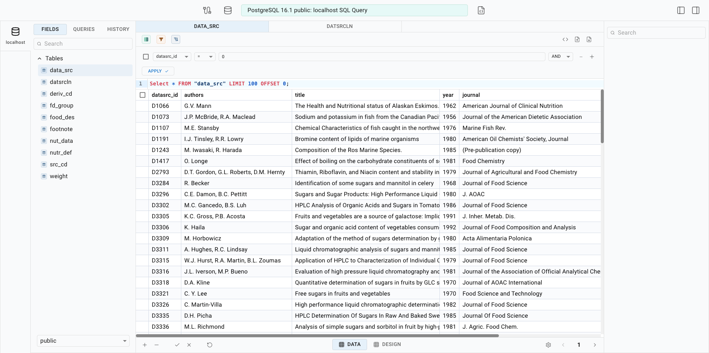
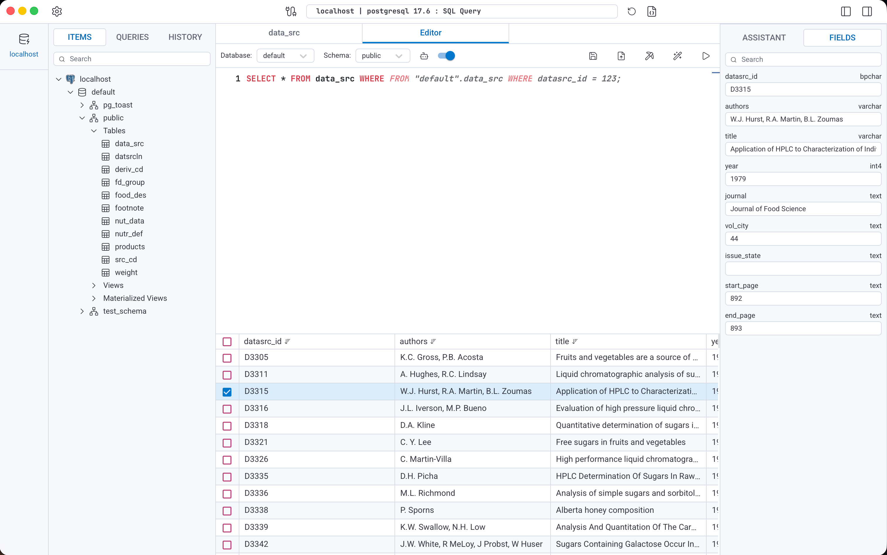

<p align="center">
  <a href="https://dbo-studio.com" target="_blank">
    
  </a>
</p>

<h1 align="center">DBO Studio</h1>

<p align="center">
  <strong>A minimal, AI-powered database GUI for modern developers</strong>
  <br />
  Manage, design, and query your data — open source and free to use.
</p>

<p align="center">
  <a href="https://dbo-studio.com">Website</a> ·
  <a href="https://github.com/dbo-studio/dbo/releases">Releases</a> ·
  <a href="https://dbo-studio.com">Live demo</a> ·
  <a href="#contributing">Contributing</a>
</p>

<p align="center">
  <a href="https://github.com/dbo-studio/dbo/blob/master/LICENSE"></a>
  <a href="https://github.com/dbo-studio/dbo/releases"></a>
  <a href="https://github.com/dbo-studio/dbo/stargazers"></a>
  <a href="https://github.com/dbo-studio/dbo/actions"></a>
</p>

> [!WARNING]
> DBO Studio is under active development and is not yet considered stable. APIs, UI, and features may change between releases.

---

## Screenshots

<p align="center">
  <a href="docs/img/table_view.png"></a>
  <a href="docs/img/db_design.png"></a>
</p>
<p align="center">
  <a href="docs/img/query_builder.png"></a>
  <a href="docs/img/query_tab.png"></a>
</p>

## Features

- **Table browser** — browse, filter, sort, and edit rows without writing SQL
- **SQL editor** — Monaco-based editor with autocomplete powered by the DBO engine and AI
- **Object designer** — create and manage schemas, tables, and other database objects
- **Query builder** — compose queries visually when you prefer not to write SQL by hand
- **AI assistant** — chat with your data, generate SQL, explain errors, and filter with natural language
- **MCP server** — expose databases to external AI tools (e.g. Cursor) via the Model Context Protocol
- **Desktop & web** — run as a desktop app or self-host with Docker

## Supported databases

| Database   | Status    |
| ---------- | --------- |
| PostgreSQL | Supported |
| SQLite     | Supported |
| MySQL      | Supported |
| MariaDB    | Planned   |
| SQL Server | Planned   |

More engines are on the roadmap.

## Quick start

### Desktop

Download the latest build for macOS, Windows, or Linux from the [Releases](https://github.com/dbo-studio/dbo/releases) page, or visit [dbo-studio.com](https://dbo-studio.com).

### Docker

```bash
docker run -d \
  -p 9000:9000 \
  -v "$(pwd)/data:/backend/data" \
  ghcr.io/dbo-studio/dbo/dbo:latest
```

Open [http://localhost:9000](http://localhost:9000).

## Development

DBO is a monorepo:

| Package  | Path        | Stack                        |
| -------- | ----------- | ---------------------------- |
| Backend  | `backend/`  | Go, Fiber, GORM              |
| Frontend | `frontend/` | React, TypeScript, Vite, MUI |
| Desktop  | `desktop/`  | Tauri                        |
| E2E      | `e2e/`      | Playwright                   |

### Prerequisites

- Go (see `backend/go.mod`)
- Node.js 20+
- npm

### Web (API + UI)

```bash
# Terminal 1 — API
cd backend && go run .

# Terminal 2 — UI (proxies to http://localhost:8080/api)
cd frontend && npm install && npm run dev
```

### Desktop

```bash
./docs/scripts/desktop_dev.sh
```

### Useful commands

```bash
# Backend
cd backend && go fmt ./... && golangci-lint run && go test ./...

# Frontend
cd frontend && npm run lint && npm run build

# E2E
cd e2e && npm test
```

For architecture and contribution conventions, see [`AGENTS.md`](AGENTS.md), [`backend/AGENTS.md`](backend/AGENTS.md), and [`frontend/AGENTS.md`](frontend/AGENTS.md).

## Contributing

DBO Studio is free and open source under the [MIT License](LICENSE). You can use it, fork it, or even offer it as a paid service.

We welcome contributions of every kind — code, docs, bug reports, and design feedback.

- Please follow the [Code of Conduct](code_of_conduct.md)
- Read the [Contributor Guidelines](CONTRIBUTING.md) before opening a PR
- Prefer opening an issue first for larger changes so we can align on design

## License

[MIT](LICENSE) © DBO Studio
